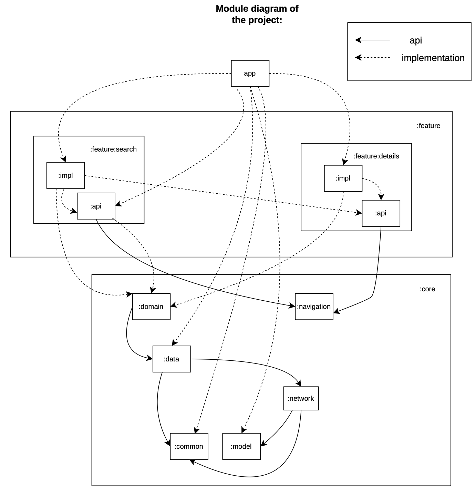

## Stack

- Kotlin
- Coroutines, Flow
- Retrofit, OkHttp
- kotlinx-serialization
- Pagination 3
- Compose: UI
- ViewModel
- Navigation 3
- Dagger Hilt

Architecture:
Modularity, design pattern - MVVM.

Modules:

<table>
  <tr>
   <td><strong>Name</strong></td>
   <td><strong>Description</strong></td>
  </tr>
  <tr>
   <td>app</td>
   <td>Includes UI scaffolding and navigation 
GifApp, MainActivity, AppAplication. App-level controlled navigation via GifAppState
   </td>
  </tr>
  <tr>
   <td>feature:details:api 
   </td>
   <td>Navigation key - GifDetailsNavKey. Can use to navigate to this or another feature.  
   Module exposes Navigator.navigateToDetails function that
   :search:impl module uses it to navigate from the SearchScreen to the GifDetailsScreen when
   gif is clicked. 
   </td>
  </tr>
  <tr>
   <td>feature:details:impl 
   </td>
   <td> Provides GifDetailsScreen, GifDetailsViewModel, UI components, GifDetailsEntryProvider, Utils.
   </td>
  </tr>
<tr>
   <td>feature:search:api 
   </td>
   <td>Navigation key - SearchNavKey. Used to navigate to this feature.  
  </tr>
<tr>
   <td>feature:search:impl</td>
   <td>Uses NavKey (SearchNavKey) to navigate SearchScreen + from the SearchScreen to the GifDetailsScreen when
   gif is clicked. Provides SearchScreen, SearchViewModel, UI Components, SearchEntryProvider, Utils.
  </tr>
  <tr>
   <td>core:data</td>
   <td>Repository, Repository implementation, PagingSource, DI (DataModule), Mapper (toDomain), util - ConnectivityManager.</td>
  </tr>
 <tr>
   <td>core:domain</td>
   <td>Use cases for searching gifs - SearchGifsUseCase and viewing gif details - GetGifDetailUseCase.</td>
  </tr>
  <tr>
   <td>core:network</td>
   <td>Making network requests. Provides DI - NetworkModule, model - dto's: SearchResponse, GifDto, GifImagesDto, ImageDataDto, MetaDto, PaginationDto, GifDetailResponse, service - ApiService, util - safeCall method.</td>
  </tr>
  <tr>
   <td>core:common</td>
   <td>Common classes shared between modules - AppError, DataResult, DI (provide Dispatcher (IO / Default) through Hilt).</td>
  </tr>
<tr>
   <td>core:navigation</td>
   <td>Holds the app's navigation back stack. Provides Navigator and NavigationState.</td>
  </tr>
  <tr>
   <td>core:model</td>
   <td>Model classes used throughout the app. Gif, GifImages, ImageData.</td>
   <td> 
   </td>
  </tr>
</table>

Module diagram:

Nested module diagrams available in each module's README:
- [app](/app)
- [feature:details:api](feature/details/api)
- [feature:details:impl](feature/details/impl)
- [feature:search:api](feature/search/api)
- [feature:search:impl](feature/search/impl)
- [core:data](core/data)
- [core:domain](core/domain)
- [core:network](core/network)
- [core:common](core/common)
- [core:navigation](core/navigation)
- [core:model](core/model)
